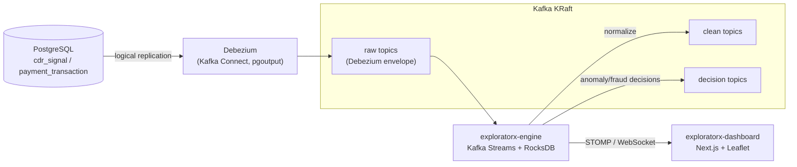

# ExploratorX — Architecture

> Skeleton document. Expanded in later phases.

## Overview

ExploratorX is an event-driven anomaly exploration platform with two modes (CDR
and Payment) sharing one infrastructure and one engine.

## High-level data flow

## Components

- **PostgreSQL** — source of truth; logical replication enabled (`wal_level=logical`).
- **Debezium / Kafka Connect** — CDC, raw Debezium envelopes (no unwrap SMT in MVP).
- **Kafka (KRaft)** — event backbone; no ZooKeeper.
- **exploratorx-engine** — Kafka Streams topology, CDR + Payment engines, REST API,
  WebSocket publisher, demo controller, Actuator metrics; RocksDB state stores.
- **exploratorx-dashboard** — live map and feeds.

## Topics

| Purpose   | CDR                                  | Payment                                   |
| --------- | ------------------------------------ | ----------------------------------------- |
| Raw (CDC) | `exploratorx.cdr.public.cdr_signal`  | `exploratorx.pay.public.payment_transaction` |
| Clean     | `exploratorx.cdr.signals.clean`      | `exploratorx.pay.transactions.clean`      |
| Decision  | `exploratorx.cdr.anomalies`          | `exploratorx.pay.fraud.alerts`            |
| Common    | `exploratorx.audit`, `exploratorx.dlq` |                                         |

Partitioning: CDR keyed by `subscriber_id`, Payment keyed by `card_token`,
minimum 3 partitions, so the same entity is always co-located for stateful checks.

## State management

No Redis in MVP. Kafka Streams local RocksDB state stores hold last-trusted signal /
transaction state; changelog topics provide restore.

## TODO (later phases)

- Detailed topology diagram
- Serde and state store specifics
- Failure handling / DLQ semantics
